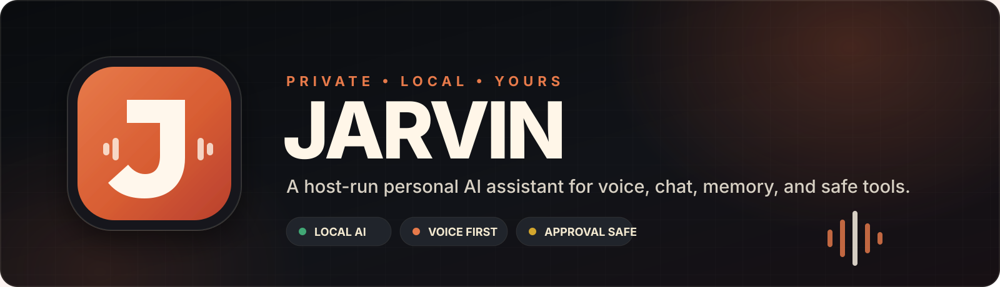
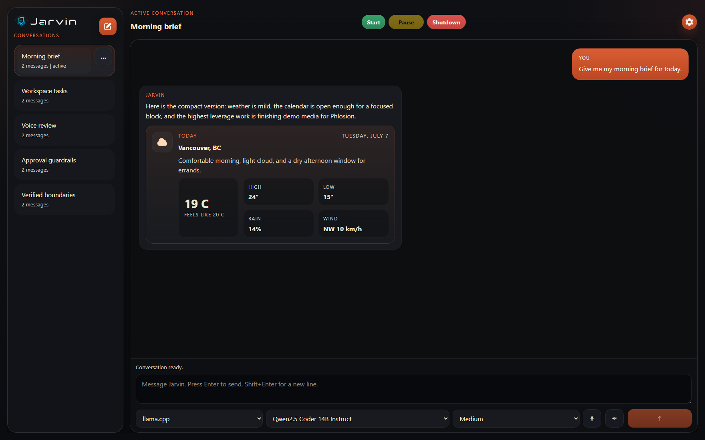
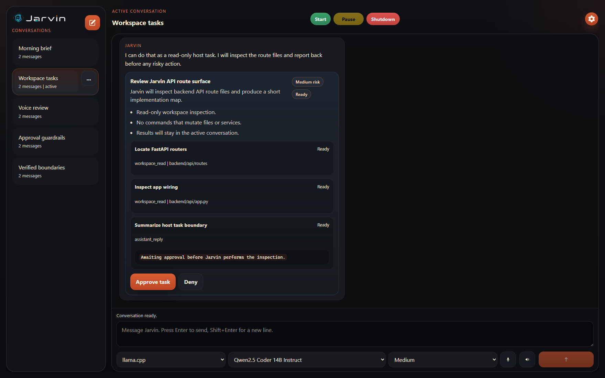
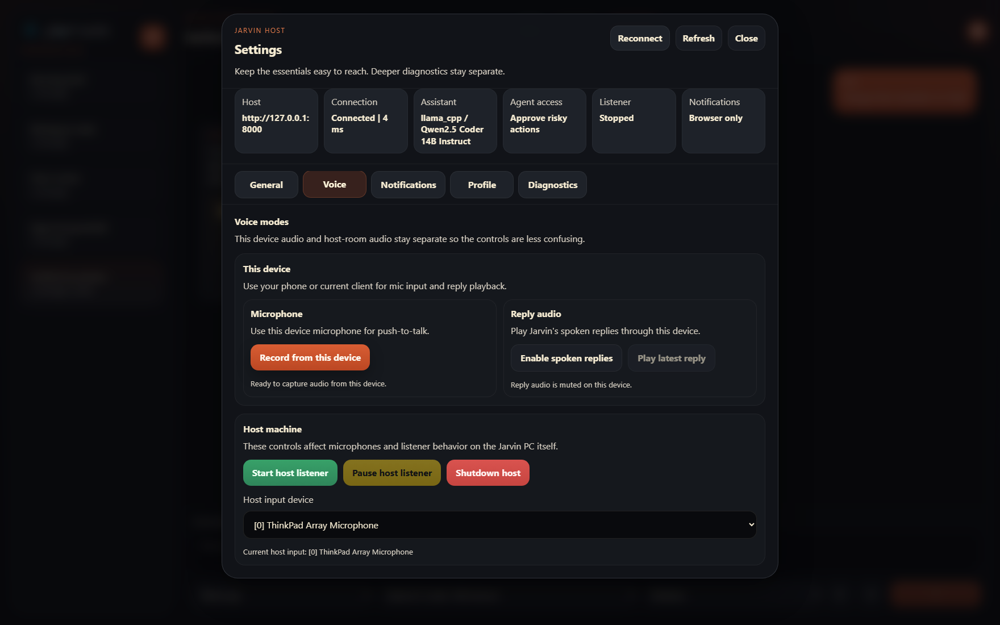
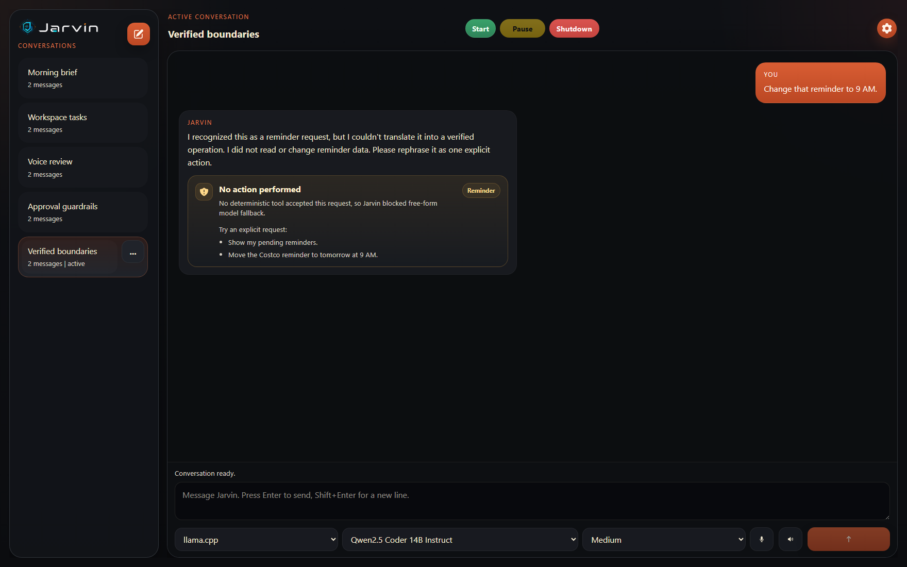

<p align="center">
  
</p>

<p align="center">
  <strong>One trusted host for local AI, voice, memory, and approval-gated tools.</strong><br />
  Desktop, browser, and Android clients stay thin while the host owns inference and personal data.
</p>

<p align="center">
  <a href="https://github.com/AdamWentworth/Jarvin/actions/workflows/ci.yml"></a>
  
  
  
  
</p>

## 🎙️ What Is Jarvin?

Jarvin is a private, host-run personal AI assistant built around local models and explicit control.

One Windows machine runs the backend, model runtimes, voice processing, SQLite state, integrations, and host tools. Other personal devices connect as clients over the local network or WireGuard instead of duplicating the heavyweight runtime.

The goal is closer to **a personal Codex that can speak** than a chatbot with a microphone attached: voice and typed conversation, useful memory, deterministic tools, remote clients, and clear approval boundaries for actions on the host.

> [!IMPORTANT]
> Jarvin is a research prototype, not a production assistant. Small local models are useful for experimentation but are not trusted to invent or confirm side effects. Calendar, reminder, weather, and host actions only count when a deterministic tool accepts the request and returns a result; otherwise Jarvin reports that nothing was executed.

## 🖥️ Product Preview

<p align="center">
  
</p>

<p align="center">
  <em>Shared conversation workspace with local model selection, voice controls, memory, and structured tool results.</em>
</p>

| Approval-gated host task | Voice and device controls |
| --- | --- |
|  |  |

<p align="center">
  
</p>

<p align="center">
  <em>Managed requests fail closed when no deterministic tool can verify the operation.</em>
</p>

The screenshots use deterministic demo fixtures from `npm run capture:demo`; they do not contain personal conversation data or require a running model.

## ✨ Highlights

- **Local model routing** — embedded `llama.cpp` by default, with an optional Ollama HTTP backend.
- **Voice on the host or phone** — Whisper transcription runs on the host while the active client can provide microphone input and play spoken replies.
- **Transcript review** — uncertain voice input is confirmed before Jarvin turns a bad transcription into an action.
- **Conversation memory** — SQLite-backed conversations, recent context, and a compact user profile.
- **Personal organization** — reminders, routines, morning briefs, and a built-in local calendar with recurring events.
- **Structured assistant tools** — weather, web research, workspace search, file reads, limited commands, and controlled file writes.
- **Approval and audit flows** — task cards, diff previews, scoped trust, and a durable host-action log for risky operations.
- **Fail-closed capability boundary** — managed requests that no deterministic tool can verify are blocked from free-form model fallback.
- **Realtime updates** — server-sent events keep listener state, conversations, task progress, and action history synchronized.
- **Shared client surface** — one React UI powers the host-served web shell, Tauri desktop app, and Tauri Android shell.
- **Mobile reminders** — synced reminders can surface through device notifications in the mobile client.

## 🧠 System Design

| Layer | Responsibility | Main technology |
| --- | --- | --- |
| Host API | Startup, chat, integrations, tools, realtime state, and client serving | FastAPI, asyncio, SSE |
| Assistant | Planner routing, follow-up context, approvals, and task execution | Python |
| Local AI | Speech recognition, model routing, inference, and speech synthesis | Whisper, llama.cpp, Ollama, pyttsx3 |
| Persistence | Conversations, profile, reminders, calendar events, and action history | SQLite, WAL |
| Shared client | Chat, settings, voice capture, task cards, and notifications | React, TypeScript, Vite |
| Native shells | Desktop and Android packaging around the shared client | Tauri 2, Rust |

### Main interaction paths

```text
Typed chat     Client → FastAPI → planner/tools or local LLM → SQLite → client
Remote voice   Phone mic → host Whisper → transcript review → chat → host TTS → phone
Host listener  Host mic → VAD → Whisper → review → local LLM → optional host playback
Host task      Request → constrained plan → approval → deterministic tool → audit log
```

See [Architecture](docs/architecture.md) for the complete runtime map and component boundaries.

## 🔒 Privacy And Safety Model

Jarvin is designed for one trusted host and private clients—not direct public-internet exposure.

- Model inference and durable personal state stay on the host.
- Workspace paths are constrained to the configured repository root.
- Shell execution is limited to a small command surface and does not use a shell.
- Risky writes and commands can require an approval card before execution.
- Unhandled calendar, reminder, organizer, and live-weather requests explicitly report that no verified operation occurred.
- Host actions are recorded for later review.
- Remote use is intended to sit behind a private network such as WireGuard.

Authentication and stronger device/session guardrails are still roadmap work. Keep the host private until those boundaries are complete.

## 🚀 Quick Start

Jarvin is Windows-first and expects Python 3.11.

### 1. Create the environment

```powershell
py -3.11 -m venv .venv
.\.venv\Scripts\python -m pip install "setuptools<81" wheel
```

For the current NVIDIA/CUDA path:

```powershell
.\.venv\Scripts\python -m pip install --no-build-isolation -r requirements-gpu-cu126.txt
.\.venv\Scripts\python -m pip install -e .
```

For the general dependency path:

```powershell
.\.venv\Scripts\python -m pip install --no-build-isolation -r requirements.txt
.\.venv\Scripts\python -m pip install -e .
```

### 2. Build the shared client

```powershell
cd clients\jarvin-ui
npm ci
npm run build:host
cd ..\..
```

### 3. Start Jarvin

```powershell
python server.py
```

Open `http://127.0.0.1:8000/app/`.

Model files and local state are intentionally excluded from the repository. Jarvin can provision its preferred local model on first startup, so the first run may take longer.

## 📱 Client Options

### Tauri desktop

Start the Python host, then run:

```powershell
cd clients\jarvin-ui
npm run tauri dev
```

### Host-served browser client

```powershell
cd clients\jarvin-ui
npm run build:host
cd ..\..
python server.py
```

Open `http://<host-or-wireguard-ip>:8000/app/` from another personal device.

### Tauri Android

```powershell
cd clients\jarvin-ui
npm run tauri:android:pixel:debug
```

The Android shell uses the phone microphone and speakers while inference stays on the Jarvin host.

## 💬 Example Requests

```text
What's the weather in Burnaby near Metrotown?
How about tomorrow?

Put lunch with Sam on my calendar tomorrow at noon.
Move lunch with Sam back an hour.

Remind me to call mom tomorrow at 5pm.
Give me my morning brief.

Inspect the repo for how live updates are wired and summarize the files involved.
Research llama.cpp Windows CUDA documentation for me.
```

## 🧪 Checks

Run the backend suite:

```powershell
.\.venv\Scripts\python -m pytest tests -q
```

Build the shared client:

```powershell
cd clients\jarvin-ui
npm run build
```

Check the Tauri shell:

```powershell
cd clients\jarvin-ui\src-tauri
cargo check --locked
```

Validate host integrations and GPU support:

```powershell
.\.venv\Scripts\python scripts\validate_integrations.py --search-only
.\.venv\Scripts\python scripts\validate_integrations.py --calendar-only
.\.venv\Scripts\python scripts\diagnose_gpu.py
```

## 🗂️ Repository Map

```text
Jarvin/
├── audio/                  # Microphone capture, VAD, and WAV utilities
├── backend/
│   ├── agent/              # Planners, tools, approvals, tasks, and voice review
│   ├── api/                # FastAPI app, routes, and schemas
│   ├── asr/                # Whisper runtime
│   ├── core/               # Shared utterance pipeline and ports
│   ├── listener/           # Host microphone loop and live state
│   ├── llm/                # llama.cpp and Ollama runtime routing
│   └── tts/                # Spoken reply synthesis
├── clients/jarvin-ui/      # React client plus Tauri desktop/Android shells
├── memory/                 # SQLite conversations, calendar, reminders, and audit log
├── docs/                   # Architecture, vision, model strategy, roadmap, and runbook
├── scripts/                # Diagnostics, integration checks, and local utilities
├── tests/                  # Backend, memory, audio, configuration, and startup tests
├── config.py               # Environment-driven settings
└── server.py               # Friendly host entrypoint and virtualenv handoff
```

## 📚 Documentation

- [Product Vision](docs/product-vision.md)
- [Architecture](docs/architecture.md)
- [Local Model Strategy](docs/local-model-strategy.md)
- [Roadmap](docs/roadmap.md)
- [Runbook](docs/runbook.md)
- [Client Guide](clients/jarvin-ui/README.md)

## 🛣️ Current Direction

Jarvin is an active research prototype. The next meaningful work is focused on measured tool reliability, stronger remote authentication, durable preference memory, background jobs, and smoother mobile voice behavior—not pretending a small local model is a dependable autonomous agent or training a new foundation model.
